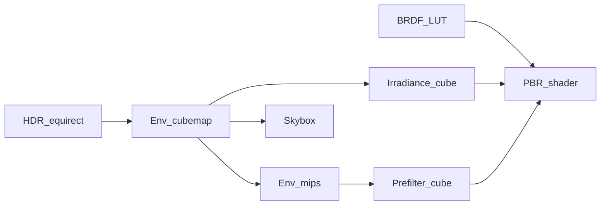

# IBL Pipeline and Relation to Debevec

This document explains what our renderer implements, how each stage maps to seminar assignment §2.9, and how that relates to Paul Debevec’s image-based lighting work. It is written for inclusion in the seminar report.

## 1. Assignment objective (§2.9)

The seminar task is to build a **real-time rendering pipeline** that uses **image-based lighting (IBL)** to illuminate **3D models** with environmental light from a **high-dynamic-range environment map**, for **physically based materials**. The pipeline must **preprocess** the environment (diffuse irradiance by convolution, specular reflections at multiple roughness levels via **importance sampling**, and **split-sum BRDF integration**), then use those maps at runtime to evaluate **diffuse and specular** contributions efficiently, and finally **evaluate visual quality and performance** and discuss **accuracy versus real-time cost**.

## 2. Our pipeline summary

| Step | Purpose | Implementation |
|------|---------|----------------|
| 1 | Load HDR equirect | `io/HdrLoader.cpp` — RGBA32F upload |
| 2 | Environment cubemap | `shaders/equirect_to_cube.wgsl`, `ibl/IblBaker.cpp` |
| 3 | Diffuse irradiance | `shaders/irradiance_convolution.wgsl` — cosine-weighted hemisphere integral |
| 4 | Env mip chain | `shaders/cubemap_mip_downsample.wgsl` — PDF sampling support for prefilter |
| 5 | Specular prefilter | `shaders/prefilter_env.wgsl` — GGX importance sampling, 1 mip per roughness |
| 6 | BRDF LUT (split-sum) | `shaders/brdf_lut.wgsl` — compute pass, RG32F |
| 7 | Real-time shading | `shaders/pbr.wgsl`, `gfx/PbrRenderer.cpp` |
| 8 | Background | `shaders/skybox.wgsl` — raw env cubemap |

Default bake sizes (Medium preset): env **512×512×6**, irradiance **32×32×6**, prefilter **128×128×6** with **5** mips, BRDF LUT **512×512**.

## 3. Debevec classical IBL (references [1][2])

### 3.1 Image-Based Modeling and Lighting (1999)

Debevec’s early IBL work motivates using **real-world illumination** captured from photographs (e.g. light probes, panoramic imagery) so synthetic objects appear lit consistently with a scene. The environment represents **distant lighting**; incoming radiance depends on direction. This is the conceptual foundation: **replace analytic lights with an environment map**.

### 3.2 Image-Based Lighting course notes (SIGGRAPH 2006)

The course material systematizes a practical pipeline:

- Store lighting in a **high dynamic range environment map** (often a cubemap or equivalent).
- **Diffuse (low-frequency)**: convolve the environment with a **broad, cosine-weighted** kernel → **irradiance environment map** (slowly varying, encodes ambient diffuse).
- **Specular (high-frequency)**: use **sharper** environment data for reflections; **glossy** surfaces need **blurred** versions of the environment at different sharpness levels (mip chains or multiple filtered probes).
- **Spatial variation**: **light probes** can capture local lighting; blending probes handles spatial change.

That era predates widespread **metallic-roughness PBR** and the **split-sum approximation** used in modern real-time engines. Debevec’s presentation is often tied to **Phong/Blinn-style** gloss and offline or semi-offline fitting, not a single GGX BRDF LUT.

## 4. Mapping table: Debevec / assignment ↔ our implementation

| Concept | Classical / assignment role | Our implementation | Same idea? | Why we differ |
|---------|------------------------------|-------------------|------------|----------------|
| Environment map | Distant scene radiance | RGBA16F cubemap from HDR equirect | Yes | GPU bake from HDR file, not mirror-ball photography |
| Diffuse / irradiance | Low-frequency convolved env | Irradiance cubemap, cosine-weighted hemisphere MC | Yes | Resolution/sample step trade-offs (see EVALUATION.md) |
| Specular / reflection | Sharp to blurry env by gloss | Prefilter cubemap, GGX importance sample, PDF mip | Conceptually yes | **GGX** + Karis-style PDF (Epic 2013), not Phong exponent |
| BRDF × environment | Often combined per lobe offline | **Split-sum**: `prefilter × (F0·A + B)` | Partial | Separates env and BRDF for real-time PBR |
| Physically based material | Not in original Debevec | Metallic-roughness + glTF textures | N/A | Required by assignment |
| Light probes / local IBL | Spatially varying probes | Single global cubemap | No | Infinite environment assumption (scope) |
| HDR display | Linear HDR workflow | Reinhard + gamma 2.2 to **LDR swapchain** | Partial | Display constraint; document as trade-off |

## 5. Why split-sum instead of “full” Debevec-style integration

The specular reflection integral for a GGX microfacet BRDF against an infinite environment is expensive to evaluate per pixel per frame. The **split-sum approximation** (Brian Karis, *Real Shading in Unreal Engine 4*, SIGGRAPH 2013; Epic PBR notes) factors the integral into:

1. **Prefiltered environment** — depends on roughness and reflection direction (stored in the prefilter cubemap mips).
2. **BRDF scale and bias** — depends on `N·V` and roughness only (stored in the 2D LUT).

At runtime: `specular ≈ prefilteredEnv(R, roughness) × (F0 · A + B)`.

**Bake cost** is paid once (or on rebake); **per-pixel cost** is a few texture samples. Debevec’s course emphasizes environment filtering; split-sum is the standard way to attach that to a **modern PBR BRDF** in real time.

## 6. Design choices in this project

| Choice | Rationale |
|--------|-----------|
| WebGPU (Dawn) | Course graphics API; explicit control over passes and formats |
| RGBA16F cubemaps | Sufficient precision for HDR env without full RGBA32F everywhere |
| 1024 MC samples (Medium) on prefilter/BRDF | Balance of bake time vs noise |
| 5 prefilter mips | `maxReflectionLod = mipLevels - 1` maps roughness ∈ [0,1] to LOD |
| Per-face GPU submit for cubemap faces | Avoids WebGPU read/write hazards during capture |
| glTF + debug spheres | Shows textured PBR hero and isolated dielectric vs metal |
| Keyboard quality presets (1/2/3 + R rebake) | Supports assignment’s performance/quality evaluation |

## 7. Known limitations (future work)

- **No parallax correction** — reflection direction ignores surface position in the infinite cube.
- **No light probes** — one global environment only.
- **No multi-bounce or occluders** — pure IBL, no shadow maps.
- **LDR output** — tone mapped for the swapchain, not HDR display.
- **Uniform-scale models** — normal matrix assumes no non-uniform scale on glTF.
- **Env rotation** — global yaw only (Y axis), sufficient for demos.

## 8. References

1. Debevec, P. *Image-based lighting.* ACM SIGGRAPH 2006 Courses. 2006.
2. Debevec, P. *Image-based modeling and lighting.* ACM SIGGRAPH Computer Graphics 33.4 (1999): 46–50.
3. Karis, B. *Real Shading in Unreal Engine 4.* SIGGRAPH 2013 Course: Physically Based Shading in Theory and Practice.
4. Epic Games. *Physically Based Rendering: Documentation.* (split-sum, prefiltering notes).
